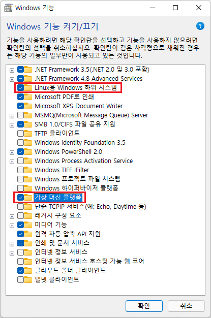

# WSL _ Ubuntu 22.04 install

## WSL setting
* Windows 기능 켜기 끄기에서 Linux용 Windows 하위 시스템과 가상 머신 플랫폼 기능을 켠다. 

# Linux 커널 업데이트 패키지를 다운로드

## linux용 window 하위 시스템사용
* PowerShell을 관리자 권한(시작 메뉴 > PowerShell >에서 관리자 권한으로 실행 >을 마우스 오른쪽 단추로 클릭)

~~~
dism.exe /online /enable-feature /featurename:Microsoft-Windows-Subsystem-Linux /all /norestart
~~~

* WSL 요구 사항 확인 

WSL 2로 업데이트하려면 Windows 10을 실행해야 합니다.( Windows 10 버전 1903 및 1909에 제공되는 WSL 2 지원)

    - x64 시스템의 경우: 버전 1903 이상, 빌드 18362.1049 이상.
    - ARM64 시스템의 경우: 버전 2004 이상, 빌드 19041 이상

* Virtual Machine 기능 사용

WSL 2를 설치하려면 먼저 Virtual Machine 플랫폼 옵션 기능을 사용하도록 설정

~~~
dism.exe /online /enable-feature /featurename:VirtualMachinePlatform /all /norestart
~~~

* Linux 커널 업데이트 패키지 다운로드

~~~
wsl.exe --install
~~~

## WSL ubuntu 22.04 install
* 설치 가능 WSL ubuntu version 확인
windows 파워쉘 (관리자 모드로 열기) 실행 , 다음 명령어를 실행한다.
~~~
wsl --list --online
~~~

* 원하는 배포판 설치

~~~
# ros2 humble 설치를 위한 설치 
wsl -- install Ubuntu-22.04
~~~

